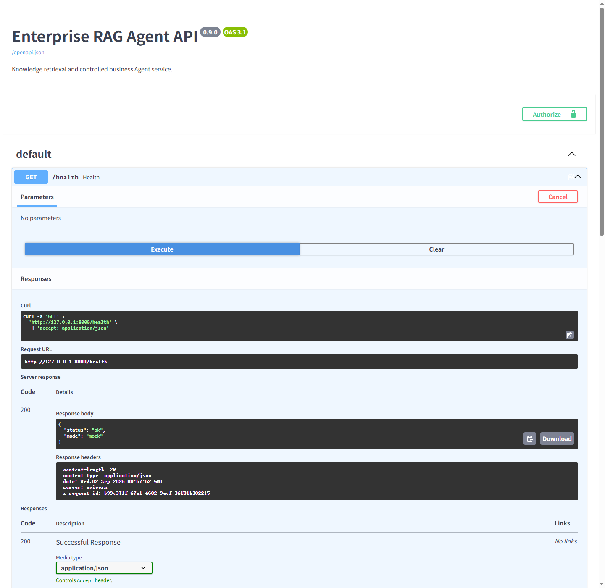

# 企业文档 RAG 与业务 Agent 服务

[](https://github.com/K1MOJ111/production-rag-agent/actions/workflows/ci.yml)

企业制度分散在不同文件中，普通问答容易编造来源，业务操作又不能绕过权限和人工确认。本服务用可追溯RAG回答文档问题，并用单个LangGraph工作流安全编排知识检索、订单、库存和取消草稿。核心实现为FastAPI、PostgreSQL/pgvector、混合检索、百炼Embedding/Rerank、DeepSeek、JWT/RBAC、PostgreSQL Checkpointer和Docker Compose。

当前仓库是可本地运行和验证的生产化实现基线，不代表已在企业生产环境或公网部署；订单和库存属于本地PostgreSQL模拟业务系统，真实模式会调用付费模型API。

## 核心能力

- TXT、PDF、DOCX 文档解析、中文分块、向量化、来源追踪和生命周期管理。
- pgvector 语义召回与 `pg_trgm` 关键词召回，通过 RRF 融合后使用 `qwen3-rerank` 二次排序。
- DeepSeek 基于检索资料生成回答；低相关问题拒答，回答引用必须匹配本次资料编号。
- LangGraph Agent 编排知识检索、订单查询、库存查询和需人工确认的操作草稿。
- Agent 检查点、线程归属和审计事件持久化到 PostgreSQL，服务重启后可以继续待确认流程。
- 订单与库存通过 PostgreSQL 业务适配器读取；取消订单经人工批准后以单事务写入本地业务状态和审计。
- PostgreSQL 本地用户、Argon2id 密码哈希、30分钟 Bearer JWT 和 RBAC 权限控制。
- 版本化 RAG/Agent Eval、分阶段耗时、LLM Token/成本记录、存活/就绪检查和自动化测试。

## 系统架构

```text
Client
  │  Bearer JWT
  ▼
FastAPI
  ├─ Auth / RBAC
  ├─ Document API
  ├─ RAG Pipeline
  │    ├─ qwen3.7-text-embedding-flash
  │    ├─ pgvector + pg_trgm + RRF
  │    ├─ qwen3-rerank
  │    └─ DeepSeek + citation validation
  └─ LangGraph Agent
       ├─ knowledge_search
       ├─ get_order ────────────────┐
       ├─ get_inventory ────────────┤
       └─ draft_order_cancellation  │
              → human approval ────┤
                                   ▼
PostgreSQL
  ├─ documents / rag_chunks
  ├─ users
  ├─ orders / inventory / cancellation_requests
  ├─ LangGraph checkpoints
  └─ agent_threads / agent_audit_events
```

更详细的组件和安全边界见 [`docs/architecture.md`](docs/architecture.md)。

## 技术栈

| 层级 | 技术 |
|---|---|
| API | FastAPI、Pydantic、Uvicorn |
| 文档处理 | pypdf、python-docx、LangChain Text Splitters |
| Embedding | 百炼 `qwen3.7-text-embedding-flash`，1024维 |
| 检索 | PostgreSQL、pgvector、`pg_trgm`、RRF |
| Rerank | 百炼 `qwen3-rerank` |
| LLM | DeepSeek `deepseek-v4-flash` |
| Agent | LangGraph `StateGraph`、`interrupt`、`Command`、PostgreSQL Checkpointer |
| 认证 | PyJWT、Argon2id、Bearer Token、RBAC |
| 数据访问 | SQLAlchemy、psycopg、langchain-postgres |
| 运行 | Docker、Docker Compose、结构化日志、健康检查 |
| 质量 | unittest、36题版本化 Eval、Recall@K、MRR、拒答/引用/Agent 安全评估 |

## 权限模型

- `viewer`：查看文档和分块，执行知识库查询。
- `operator`：继承 viewer 权限，运行 Agent、确认自己的操作草稿、查看自己的审计。
- `admin`：继承全部权限，可管理文档并读取其他用户的指定线程审计；不能替其他用户确认操作。

JWT 仅保存用户 UUID 和必要标准声明。服务严格验证 `sub`、`exp`、`iss`、`aud` 和签名算法，并在每次请求中查询数据库获取最新角色和启用状态。

## 3分钟本地体验（免费 Mock）

Mock模式不连接数据库或付费模型，只用于验证API、文档入库、检索、拒答和引用链路。应用仅绑定本机地址；不要把Mock模式或Mock账号暴露到公网。

```powershell
Copy-Item .env.example .env
```

在 `.env` 的 `MOCK_ADMIN_PASSWORD` 填入一个仅用于本机、长度12–128位的临时密码，保留 `RAG_MODE=mock`，然后启动：

```powershell
docker compose --profile app up -d --build
Invoke-RestMethod http://127.0.0.1:8000/health
```

打开 `http://127.0.0.1:8000/docs`：

1. 点击 **Authorize**，用户名填写 `mock-admin`，密码使用刚设置的本机临时密码。
2. 执行 `POST /documents/load-samples`，一次导入仓库内3份样例制度。
3. 执行 `POST /qa/ask`，请求体填写 `{"question":"差旅报销需要准备哪些材料？","top_k":3}`。
4. 再询问“火星基地什么时候开放？”，确认返回 `is_refused=true`。



截图由本地Mock服务的Swagger实际执行 `/health` 后生成；响应为HTTP 200、`mode=mock`。

## 真实模式配置

在被Git忽略的 `.env` 中设置 `RAG_MODE=real`、PostgreSQL连接、百炼和DeepSeek API配置，以及至少32字节的随机 `JWT_SECRET`：

```powershell
[Convert]::ToHexString([Security.Cryptography.RandomNumberGenerator]::GetBytes(32))
docker compose --profile app up -d --build
```

创建首个管理员：

```powershell
cd backend
../.venv/Scripts/python.exe -m dotenv -f ../.env run -- `
  ../.venv/Scripts/python.exe -m app.create_user admin --role admin
```

密码通过终端隐藏输入，不进入命令历史。`POST /auth/token` 使用表单字段 `username` 和 `password` 换取短期JWT，后续请求携带 `Authorization: Bearer <access_token>`。

## 5分钟核心链路验证（已配置真实模式）

1. 在Swagger中登录管理员，执行 `POST /documents/load-samples` 和 `POST /qa/ask`，检查来源文件及引用编号。
2. 用CLI创建一个 `operator`，登录后执行 `POST /agent/run`：`{"thread_id":"verify-cancel-001","message":"取消订单 ORD-1002，原因是重复下单"}`。
3. 确认首次响应为 `needs_confirmation`，并且草稿中的 `executed=false`。
4. 执行 `POST /agent/confirm`：`{"thread_id":"verify-cancel-001","approved":true}`，确认本地订单状态更新且产生审计记录。
5. 执行 `GET /agent/verify-cancel-001/audit`，核对actor、thread、action、result和request_id。

该批准操作只更新本地PostgreSQL模拟业务表，不连接企业ERP、支付或仓储系统。重复验证前应使用新的待处理订单或重置本地测试数据。

## API

| 方法 | 路径 | 最低权限 | 说明 |
|---|---|---|---|
| `GET` | `/health` | 公开 | 进程存活检查 |
| `GET` | `/ready` | 公开 | PostgreSQL 与 Agent 检查点就绪检查 |
| `POST` | `/auth/token` | 公开 | 用户名密码换取短期 JWT |
| `POST` | `/documents/upload` | admin | 通过 JSON 上传文本，保留兼容接口 |
| `POST` | `/documents/upload-file` | admin | 通过 multipart 上传 TXT、PDF 或 DOCX |
| `POST` | `/documents/load-samples` | admin | 导入仓库内的参考文档 |
| `GET` | `/documents` | viewer | 查询文档列表 |
| `GET` | `/documents/{id}/chunks` | viewer | 查询文档分块 |
| `DELETE` | `/documents/{id}` | admin | 删除文档及向量 |
| `POST` | `/qa/ask` | viewer | 执行混合检索与基于证据的回答 |
| `POST` | `/agent/run` | operator | 运行 Agent 或生成待确认草稿 |
| `POST` | `/agent/confirm` | operator | 批准或拒绝自己的草稿 |
| `GET` | `/agent/{thread_id}/audit` | operator | 查看授权范围内的线程审计 |

Mock模式实际请求：

```json
{"question": "差旅报销需要准备哪些材料？", "top_k": 3}
```

实际响应字段摘录（答案正文中间部分用省略号缩短）：

```json
{
  "answer": "根据知识库中与‘差旅报销需要准备哪些材料？’最相关的资料……[资料 1]",
  "sources": [
    {
      "citation_id": 1,
      "filename": "员工报销制度.txt",
      "file_type": "txt",
      "page_number": null,
      "section": null
    }
  ],
  "is_refused": false
}
```

同次实际运行导入3份样例文档；完整响应还包含检索片段、分数和Prompt。动态文档ID、分块ID和请求ID不写入README。

## 多格式文档入库

文件上传上限为 10 MiB。TXT 必须使用 UTF-8；PDF 按页保存来源，DOCX 按标题和段落保存来源。扫描版 PDF 不做 OCR，无法提取文字时接口会明确返回 400。

```powershell
curl.exe -X POST http://127.0.0.1:8000/documents/upload-file `
  -H "Authorization: Bearer $token" `
  -F "file=@.\travel-policy.pdf;type=application/pdf"
```

Mock 模式实际响应示例：

```json
{
  "document_id": "doc_216872c3",
  "filename": "travel-policy.pdf",
  "file_type": "pdf",
  "chunk_count": 1,
  "status": "success"
}
```

查询响应中的来源会保留文件和页码：

```json
{
  "citation_id": 1,
  "document_id": "doc_216872c3",
  "filename": "travel-policy.pdf",
  "chunk_id": "doc_216872c3_chunk_001",
  "score": 0.7559,
  "content": "Quartz travel reimbursement requires invoice and itinerary.",
  "file_type": "pdf",
  "page_number": 1,
  "section": null
}
```

相同提取内容再次上传时返回 409；删除文档会同时删除对应分块和向量。

## 本地业务数据与受控写操作

真实模式启动时会创建最小的 `orders`、`inventory` 和 `cancellation_requests` 表，并以 `ON CONFLICT DO NOTHING` 导入两条本地参考订单和库存。Agent 的 `get_order`、`get_inventory` 只通过业务适配器查询这些表，不在节点中直接写 SQL。

取消流程分为两步：

1. `draft_order_cancellation` 校验订单并生成草稿，通过 LangGraph `interrupt` 暂停；此时不写业务表。
2. 原线程所属用户批准后，系统在同一事务中写入取消记录、把允许取消的订单更新为“已取消”，并记录包含 actor、thread、action、result 和 request_id 的审计事件。

拒绝不会产生业务写入；`thread_id + action + order_id` 形成幂等键，进程恢复或重复执行不会重复取消。这里验证的是本地 PostgreSQL 业务系统集成，不代表已接入企业 ERP。

## 开发与测试

`RAG_MODE=mock` 是确定性的本地测试适配器，不连接数据库和付费模型；真实运行使用 `RAG_MODE=real`。

安装依赖并运行普通测试：

```powershell
python -m pip install -r requirements-dev.txt
cd backend
python -m unittest discover -s tests -v
```

普通测试不会调用付费模型。PostgreSQL 持久化测试：

```powershell
cd backend
$env:RUN_POSTGRES_INTEGRATION='1'
../.venv/Scripts/python.exe -m dotenv -f ../.env run -- `
  ../.venv/Scripts/python.exe -m unittest `
  tests.test_m4_persistence tests.test_m6_auth.AuthPostgresTest `
  tests.test_m7_documents.M7PostgresTest tests.test_m8_business `
  tests.test_m8_api_auth -v
```

运行确定性的免费 Eval：

```powershell
cd backend
../.venv/Scripts/python.exe -m evals.run_eval --mode mock
```

报告按运行时间分别写入 `backend/evals/results/` 的 JSON 和 Markdown 文件，不覆盖既有结果。当前仓库保存的实际 Mock 报告为 [`m9-mock-20260902T091204641448Z.md`](backend/evals/results/m9-mock-20260902T091204641448Z.md)：36题中25题通过；Recall@3、MRR@3、来源匹配率和已回答问题的引用合法率均为1.0，拒答准确率为0.6944；确定性 Agent 场景7/7通过。失败集中在2道口语改写误拒答，以及无关/诱导问题在Mock低阈值下的误接受。该结果是本地回归基线，不代表真实模型质量或线上指标。

显式运行真实 Eval 会调用 PostgreSQL、百炼和 DeepSeek，并产生模型费用：

```powershell
cd backend
$env:RUN_REAL_EVAL='1'
../.venv/Scripts/python.exe -m dotenv -f ../.env run -- `
  ../.venv/Scripts/python.exe -m evals.run_eval --mode real
```

真实报告记录供应商响应中的 LLM Token。若在 `.env` 配置每百万输入/输出 Token 单价，则同时计算估算成本；Embedding、Rerank 或供应商未返回的用量会明确标记为不可用，不做推测。

以下真实集成测试同样会产生少量模型费用，默认跳过：

```powershell
cd backend
$env:RUN_REAL_INTEGRATION='1'
../.venv/Scripts/python.exe -m dotenv -f ../.env run -- `
  ../.venv/Scripts/python.exe -m unittest `
  tests.test_real_integration tests.test_m2_real_eval tests.test_m3_real_agent -v
```

## 持续集成

`.github/workflows/ci.yml` 在push、pull request和手动触发时使用Python 3.12运行：

- 普通 `unittest` 测试；
- 免费Mock Eval；
- `pip check` 依赖一致性检查；
- 跟踪文件中的`.env`、私钥、JWT、常见API密钥格式和本机绝对路径扫描。

工作流不读取仓库Secret、不调用付费模型，`GITHUB_TOKEN`只有 `contents: read` 权限。本地可运行相同仓库检查：

```powershell
python scripts/check_repository.py
```

## 完成范围与上线前缺口

| 状态 | 内容 |
|---|---|
| 已完成 | TXT/PDF/DOCX入库、来源追踪、混合检索/Rerank、拒答与引用校验、单Agent工具调用、人工确认、PostgreSQL状态/审计、JWT/RBAC、Eval、Docker和CI |
| 未实现 | OCR、多模态解析、复杂前端、多Agent、企业OIDC、真实ERP/支付/仓储接入、Redis/Kafka/Kubernetes、云服务器部署 |
| 公网生产前补充 | HTTPS与可信网关、登录限流、密钥托管和轮换、数据库备份恢复、集中日志/指标/告警、容量压测、依赖与镜像漏洞治理 |

## 数据与安全边界

- 订单、库存和取消记录属于本地 PostgreSQL 模拟业务系统；没有连接企业 ERP、支付、仓储或售后系统。
- 取消订单批准后会真实更新本地数据库，但不会执行任何外部业务写操作。
- 文档解析支持可提取文字的 TXT、PDF 和 DOCX；不支持 OCR、扫描件识别、复杂版式还原或多模态内容。
- 引用校验保证引用编号来自本次检索结果，但不等同于逐句事实一致性评估。
- 当前提交仅运行并保存了 Mock Eval；真实 Eval 尚未运行，不能据此声称真实模型准确率、延迟或成本。
- JWT 不加密，当前没有 Refresh Token、撤销列表、开放注册、登录限流或企业 OIDC。
- 当前交付物是 Docker Compose 部署基线；公开网络部署前必须增加 HTTPS、入口限流、集中日志、指标告警和密钥托管。

## 项目文档

- [`docs/architecture.md`](docs/architecture.md)：架构、数据流和安全设计。
- [`docs/stage_status.md`](docs/stage_status.md)：阶段门禁和验证证据。

本项目采用 [MIT License](LICENSE)。
